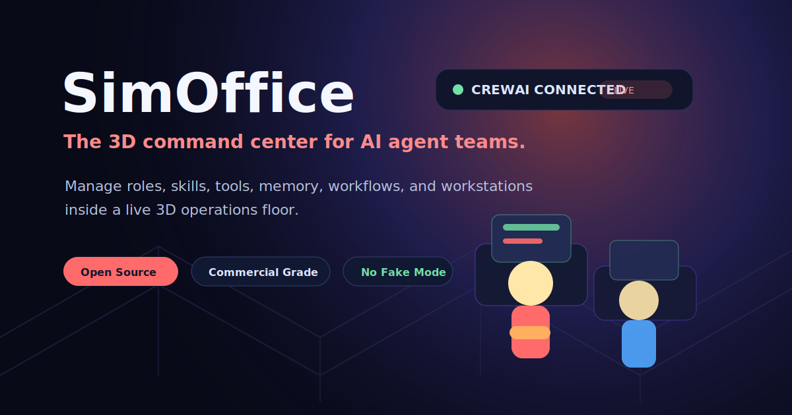

# simOFFICE-ai

<p align="center">
  
</p>

<p align="center">
  
</p>

<h3 align="center">Give agents a floor. Not a chat thread.</h3>

<p align="center">A 3D command center for managing AI agent teams and tool-enabled office stations.</p>

<p align="center">
  <a href="https://lumenhelixlab.github.io/simOFFICE-ai/">Launch Page</a>
  <span> · </span>
  <a href="https://github.com/lumenhelixlab/simOFFICE-ai">GitHub</a>
  <span> · </span>
  <a href="https://lumenhelix.com">LumenHelix</a>
</p>

---

SimOffice is a 3D command center for AI agent teams. Instead of burying agents in a chat sidebar, it gives them an operational floor with departments, furniture-based tool stations, runtime status, skill grants, workflows, and memory controls.

## Why simOFFICE-ai

- **Make agents manageable.** Visual location and station access turn invisible prompts into inspectable operations.
- **No fake output.** If the backend is offline, the UI is still editable but agent execution is intentionally blocked.
- **Run locally or containerized.** Native dev mode or docker compose up --build for the full stack.

## Quick start

### macOS / Linux

```bash
git clone https://github.com/lumenhelixlab/simOFFICE-ai.git
cd simOFFICE-ai
git clone https://github.com/LumenHelixLab/simOFFICE-ai.git
cd simOFFICE-ai
# Terminal 1: backend
cd backend && python3 -m venv .venv && .venv/bin/pip install -r requirements.txt && cp .env.example .env && .venv/bin/uvicorn main:app --reload --host 0.0.0.0 --port 8080
# Terminal 2: client
cd client && npm install && npm run dev
```

### Windows (PowerShell)

```powershell
git clone https://github.com/lumenhelixlab/simOFFICE-ai.git
Set-Location simOFFICE-ai
git clone https://github.com/LumenHelixLab/simOFFICE-ai.git
Set-Location simOFFICE-ai
# Terminal 1: backend
cd backend; python -m venv .venv; .venv\Scripts\pip install -r requirements.txt; copy .env.example .env; .venv\Scripts\uvicorn main:app --reload --host 0.0.0.0 --port 8080
# Terminal 2: client
cd client; npm install; npm run dev
```

### Windows (Git Bash / WSL)

```bash
git clone https://github.com/lumenhelixlab/simOFFICE-ai.git
cd simOFFICE-ai
git clone https://github.com/LumenHelixLab/simOFFICE-ai.git
cd simOFFICE-ai
# Terminal 1: backend
cd backend && python3 -m venv .venv && .venv/bin/pip install -r requirements.txt && cp .env.example .env && .venv/bin/uvicorn main:app --reload --host 0.0.0.0 --port 8080
# Terminal 2: client
cd client && npm install && npm run dev
```

> Tested on Windows 11, macOS Sonoma, Ubuntu 22.04/24.04, and modern mobile browsers.

## Features

| Feature | What it gives you |
|---------|-------------------|
| 3D operations floor | React Three Fiber workspace with executive, finance, infrastructure, operations, and marketing departments. |
| Furniture-to-skill model | Office stations grant operational capabilities to agents, making permissions visible and explicit. |
| Real backend execution | CrewAI/FastAPI bridge runs actual agent tasks; the UI does not fake output when disconnected. |
| Command rail and inspectors | Fast agent switching without blocking the 3D view, plus right-side inspectors for agents, skills, runtime, and memory. |

## Architecture

```
Operators  ->  React Three Fiber Client  ->  FastAPI Bridge  ->  CrewAI Agents  ->  Tool Stations
                ^                                                                      |
                └────────────── Runtime status, skills, memory ────────────────────────┘
```

## Development

```bash
# Full stack with Docker
docker compose up --build

# Or native dev:
# Terminal 1: cd backend && python -m venv .venv && .venv\Scripts\uvicorn main:app --reload --host 0.0.0.0 --port 8080
# Terminal 2: cd client && npm install && npm run dev
```

## Roadmap

- [ ] Harden real backend execution and furniture/skill mapping
- [ ] Polished management UI and agent control plane
- [ ] SimAI-compatible runtime adapter for external workflow agents

## License

Released under the MIT License.

---

<p align="center">
  <sub>simOFFICE-ai is a <a href="https://lumenhelix.com">LumenHelix</a> project — Applied Symbolic Dynamics & Reversible Computation.</sub>
</p>
